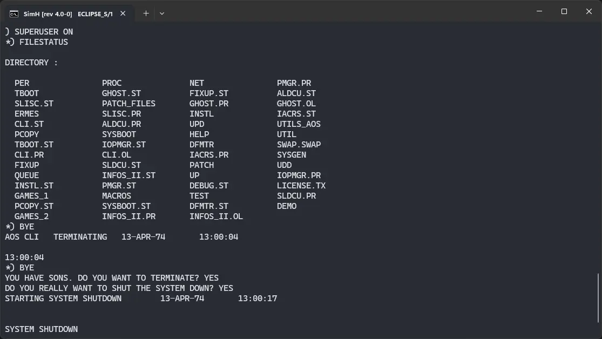
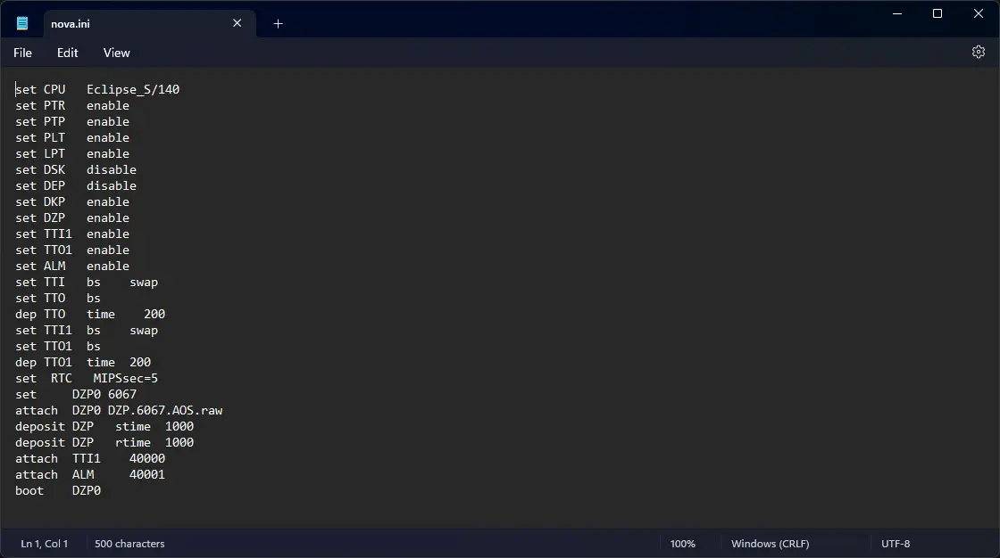
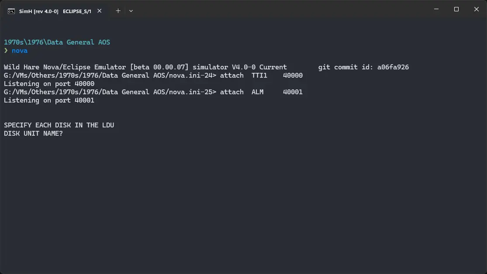

# How to install ! Data General AOS on Wild Hare Nova emulator?



We can run [! Data General AOS](/1970s/1976/dg-aos) on the Wild Hare Nova emulator. First, we need to download the ! Data General AOS disk image.

## Downloads

You can download the disk image needed to run ! Data General AOS on the Wild Hare Nova emulator from the [Wild Hare Legacy Preservation Website website](http://www.novasareforever.org/):

- [! Data General AOS disk image](http://www.novasareforever.org/archive/public/wh/simh/disks/DZP.6067.AOS.raw)

## Using ! Data General AOS

:::tip

If you have not already installed Wild Hare Nova emulator, see [the VirtualHub Setup tutorial on how to do so](https://setup.virtualhub.eu.org/wh-nova/) on Linux and Windows.

:::

Create a folder somewhere to store the files for this VM and move the disk image you just downloaded into it. Now we will create a config file for our VM. Create a text file called `nova.ini` with the following content in the VM folder:

```ini
set CPU   Eclipse_S/140
set PTR   enable
set PTP   enable
set PLT   enable
set LPT   enable
set DSK   disable
set DEP   disable
set DKP   enable
set DZP   enable
set TTI1  enable
set TTO1  enable
set ALM   enable
set TTI   bs    swap
set TTO   bs
dep TTO   time    200
set TTI1  bs    swap
set TTO1  bs
dep TTO1  time  200
set  RTC   MIPSsec=5
set     DZP0 6067
attach  DZP0 DZP.6067.AOS.raw
deposit DZP   stime  1000
deposit DZP   rtime  1000
attach  TTI1    40000
attach  ALM     40001
boot    DZP0
```



Now open a terminal and move to the VM folder. Run the following command to start the emulator:

```bash
nova
```



When prompted `DISK UNIT NAME? `, type `DPF0` and press enter. When asked for device code and system pathname, just press enter without typing anything.

When asked for date, enter it in `MM/DD/YY` format. For example, enter `04/13/76`. Keep the year in 1970s or 80s, to avoid any issues. Similarly, when asked for time, enter it in `HH:MM:SS` format. For example, enter `12:55:31`. You will be asked if you want to override default specs. Just press enter to accept the defaults.

You will get a `)` prompt. Run the following commands:

```bash
CHAR/NAS/CPL=166
SEARCH :util : :MACROS :PER
SUPERUSER ON
```

The prompt will change to `*)`. Type `UP` and press enter to start ! Data General AOS. Press enter a few times till you get a `)` prompt.

Now you can run `SUPERUSER ON` and then `FILESTATUS` to list all the files available on the disk.


That's it! We used ! Data General AOS. To exit super user mode, type `BYE` and press enter. To shutdown the system, run `BYE` again. You will be asked twice if you really want to shutdown. Type `YES` and press enter both times to shutdown. Don't worry, it won't harm your children in any way.

We can create a shell script to make it easy to launch the VM.

### Linux

Create a file called `DG-AOS.sh` with the following content:

```bash
#!/bin/bash
nova
```

Now make the file executable:

```bash
chmod +x DG-AOS.sh
```

Now you can start the VM using the shell script. For example, on KDE you can right-click the file and choose `Run in Konsole` or on GNOME, where you can right-click the file and choose `Run as executable`. The VM will start.

See the [manuals section](/1970s/1976/dg-aos/#manuals) on the [main ! Data General AOS page](/1970s/1976/dg-aos/) to learn how to use it.

### Windows

Create a file called `DG-AOS.bat` with the following content:

```bash
nova
```

Now you can start the VM by double-clicking the shell script. See the [manuals section](/1970s/1976/dg-aos/#manuals) on the [main ! Data General AOS page](/1970s/1976/dg-aos/) to learn how to use it.

## Credits

- The disk image and other files used above are from the [Wild Hare Legacy Preservation Website website](http://www.novasareforever.org/).

## Video tutorial

Do you want to follow the tutorial by watching a video? We will post a video on our [YouTube channel](https://www.youtube.com/@virtua1hub) soon.

Archives of this tutorial are available on [Wayback Machine](https://web.archive.org/web/*/https://virtualhub.eu.org/1970s/1976/dg-aos/wh/).
