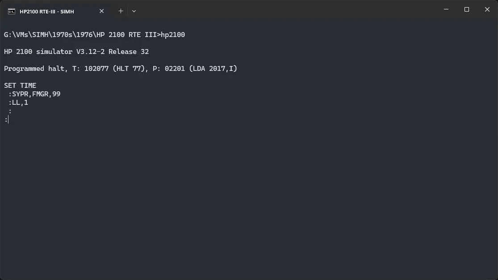

# ! HP 2100 RTE-III

import DocCardList from '@theme/DocCardList';

! HP 2100 RTE-III, as the name suggests, was an operating system for the HP 2100 computer. We can run using the SIMH emulator.

<DocCardList />

## Manuals

You can download the ! HP 2100 RTE-III manuals from here:

- [HP Algol Reference Manual](https://github.com/rsanchovilla/SimH_cpanel/blob/master/Manual/HP2100/RTE-III/02116-9072_HP%20ALGOL%20Nov-1976.pdf)
- [Multi-User Real-Time BASIC Reference Manual](https://github.com/rsanchovilla/SimH_cpanel/blob/master/Manual/HP2100/RTE-III/Multi_UserRealTimeBASIC_ReferenceManual_92060-90016_276pages_Apr-1981.pdf)
- [Pascal-S Manual](https://github.com/rsanchovilla/SimH_cpanel/blob/master/Manual/HP2100/RTE-III/Wirth-PascalS.pdf)
- [! RTE III Assembler Reference Manual](https://github.com/rsanchovilla/SimH_cpanel/blob/master/Manual/HP2100/RTE-III/RTE_AssemblerReferenceManual_92060-90005_117pages_Dec78.pdf)
- [! RTE III Batch Spool Monitor Programming And Operating Manual](https://github.com/rsanchovilla/SimH_cpanel/blob/master/Manual/HP2100/RTE-III/RTE_BatchSpoolMonitor_ProgrammingAndOperatingManual_92002-93001_218pages_Feb75.pdf)
- [! RTE III Batch Spool Monitor Student Workbook](https://github.com/rsanchovilla/SimH_cpanel/blob/master/Manual/HP2100/RTE-III/RTE_BatchSpoolMonitor_StudentWorkbook_22999-90026_212pages_Jun75.pdf)
- [! RTE III General Information Manual](https://bitsavers.org/pdf/hp/21xx/rteIII/92060-90009_genInfo_Feb76.pdf)
- [! RTE III New User Guide](https://bitsavers.org/pdf/hp/21xx/rteIII/92060-90012_newUsrGde_Aug78.pdf)
- [! RTE III Online Gnerator Reference Manual](https://bitsavers.org/pdf/hp/21xx/rteIII/92060-90020_onlineGen_Jul77.pdf)
- [! RTE III Programming And Operating Manual](https://github.com/rsanchovilla/SimH_cpanel/blob/master/Manual/HP2100/RTE-III/RTE-III_ProgrammingAndOperatingManual_92060-90004_270pages_Jul76.pdf)
- [! RTE III Utility Programs Reference Manual](https://bitsavers.org/pdf/hp/21xx/rteIII/92060-90017_rteUtil_Jul80.pdf)

You may also be interested in the HP 2100 manuals. They were the computers on which ! HP 2100 RTE-III was supposed to run. You can download them from Bitsavers:

- [HP 2100 Manuals](http://www.bitsavers.org/pdf/hp/21xx/)

## Related Pages

- [VirtualHub Screenshots](https://screenshots.virtualhub.eu.org/1970s/1976/rte-iii/)
- [HP 2100 Wikipedia page](https://en.wikipedia.org/wiki/HP_2100)
- [Third Party HP2100 Archive (via Wayback Machine)](https://web.archive.org/web/20160430080039/http://oscar.taurus.com/~jeff/2100/index.html)

## Credits

- The manuals were taken from [Bitsavers](http://bitsavers.org) and a [GitHub repo](https://github.com/rsanchovilla/SimH_cpanel) of user [rsanchovilla](https://github.com/rsanchovilla/SimH_cpanel).
