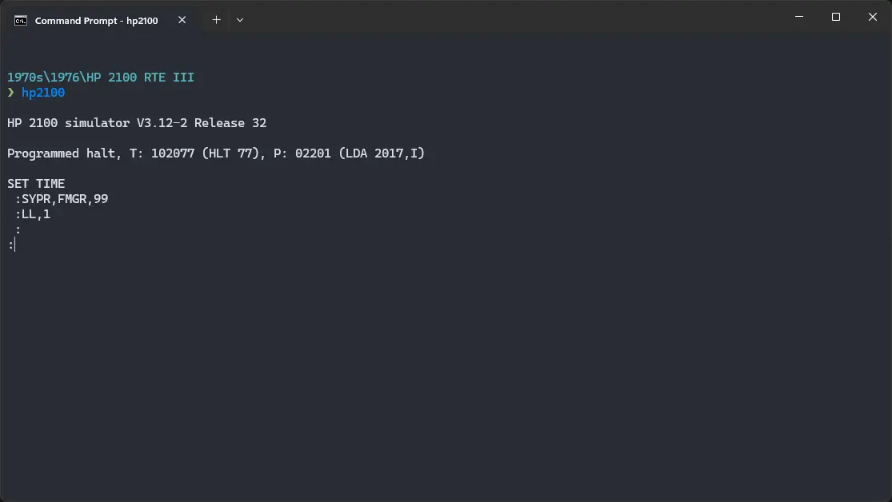
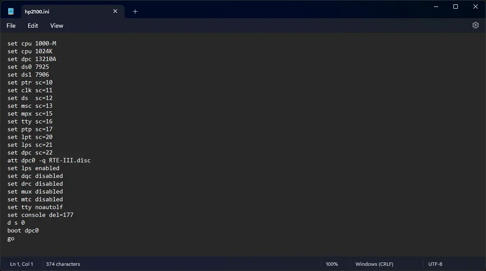

# How to install ! HP 2100 RTE-III on SIMH?



We can run [! HP 2100 RTE-III](/1970s/1976/rte-iii) on the SIMH HP 2100 emulator. First, we need to download the ! HP 2100 RTE-III disk image.

## Downloads

You can download the disk image needed to run ! HP 2100 RTE-III on the SIMH HP 2100 emulator from our [GitHub repository](https://github.com/InstallerLegacy/HP2100):

:::tip

The disk image comes from [a zip file](https://github.com/rsanchovilla/SimH_cpanel/blob/master/test_run/HP2100/HP2100.zip) in GitHub user ["rsanchovilla"](https://github.com/rsanchovilla)'s [SimH_cpanel](https://github.com/rsanchovilla/SimH_cpanel) repository. You can extract the disk image from that zip file yourself, if you want.

:::

- [! HP 2100 RTE-III disk image](https://github.com/InstallerLegacy/HP2100/raw/refs/heads/main/sw/RTE-III/RTE-III.disc)

## Using ! HP 2100 RTE-III

:::tip

If you have not already installed SIMH HP 2100 emulator, see [the VirtualHub Setup tutorial on how to do so](https://setup.virtualhub.eu.org/simh-hp2100/) on Linux and Windows.

:::

Create a folder somewhere to store the files for this VM and move the disk image you just downloaded into it.

Now we will create a config file for our VM. Create a text file called `hp2100.ini` with the following content in the VM folder:

```ini
set cpu 1000-M
set cpu 1024K
set dpc 13210A
set ds0 7925
set ds1 7906
set ptr sc=10
set clk sc=11
set ds  sc=12
set msc sc=13
set mpx sc=15
set tty sc=16
set ptp sc=17
set lpt sc=20
set lps sc=21
set dpc sc=22
att dpc0 -q RTE-III.disc
set lps enabled
set dqc disabled
set drc disabled
set mux disabled
set mtc disabled
set tty noautolf
set console del=177
d s 0
boot dpc0
go
```



Now open a terminal and move to the VM folder. Run the following command to start the emulator:

```bash
hp2100
```


That's it! We used ! HP 2100 RTE-III. We can create a shell script to make it easy to launch the VM.

### Linux

Create a file called `RTE-III.sh` with the following content:

```bash
#!/bin/bash
hp2100
```

Now make the file executable:

```bash
chmod +x RTE-III.sh
```

Now you can start the VM using the shell script. For example, on KDE you can right-click the file and choose `Run in Konsole` or on GNOME, where you can right-click the file and choose `Run as executable`. The VM will start.

See the [manuals section](/1970s/1976/rte-iii/#manuals) on the [main ! HP 2100 RTE-III page](/1970s/1976/rte-iii/) to learn how to use it.

### Windows

Create a file called `RTE-III.bat` with the following content:

```bash
hp2100
```

Now you can start the VM by double-clicking the shell script. See the [manuals section](/1970s/1976/rte-iii/#manuals) on the [main ! HP 2100 RTE-III page](/1970s/1976/rte-iii/) to learn how to use it.

## Credits

- The disk image comes from [a zip file](https://github.com/rsanchovilla/SimH_cpanel/blob/master/test_run/HP2100/HP2100.zip) in GitHub user ["rsanchovilla"](https://github.com/rsanchovilla)'s [SimH_cpanel](https://github.com/rsanchovilla/SimH_cpanel) repository.

## Video tutorial

Do you want to follow the tutorial by watching a video? We will post a video on our [YouTube channel](https://www.youtube.com/@virtua1hub) soon.

Archives of this tutorial are available on [Wayback Machine](https://web.archive.org/web/*/https://virtualhub.eu.org/1970s/1976/rte-iii/simh/).
