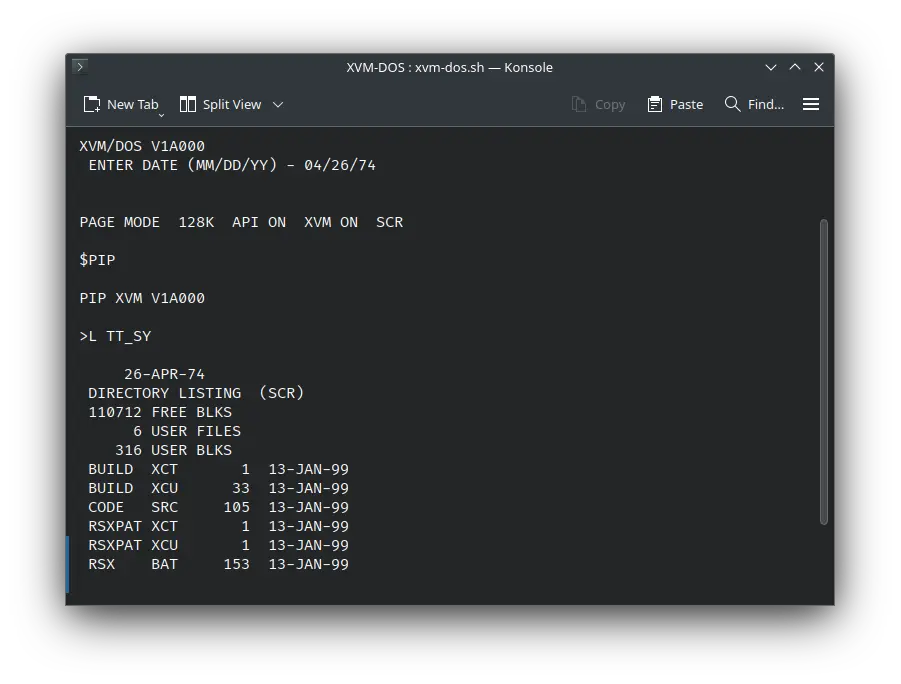

import DocCardList from '@theme/DocCardList';

# ! XVM/DOS & ! XVM/RSX

! XVM/DOS and ! XVM/RSX were operating systems for the DEC PDP-15 computer. We can run them on the SIMH PDP-15 emulator.

<DocCardList />

## Manuals

### ! XVM/DOS

You can download the ! XVM/DOS manuals from here:

- [Reader’s Guide](http://www.bitsavers.org/pdf/dec/pdp15/XVM/DEC-XV-ODGIA-A-D-XVM_DOS_READERS_GUIDE_AND_MASTER_INDEX.pdf)

#### Concepts

- [User’s Manual](http://www.bitsavers.org/pdf/dec/pdp15/XVM/DEC-XV-ODMAA-A-D_XVMdosUM.pdf)
- [System Manual](http://www.bitsavers.org/pdf/dec/pdp15/XVM/DEC-XV-ODSAA-A-D_XVMdosSys.pdf)
- [BOSS/XVM User’s Manual](http://www.bitsavers.org/pdf/dec/pdp15/XVM/DEC-XV-OBUAA-A-D_BossXVM.pdf)

#### File Utilities

- [PIP Manual](http://www.bitsavers.org/pdf/dec/pdp15/XVM/DEC-XV-UPPUA-A-D-PIP_XVM_UTILITY_MANUAL.pdf)
- [MTDUMP Manual](http://www.bitsavers.org/pdf/dec/pdp15/XVM/DEC-XV-UMTUA-A-D_MTDUMP_UTILITY_MANUAL.pdf)

#### Languages

- [Fortran Language Manual](http://www.bitsavers.org/pdf/dec/pdp15/XVM/DEC-XV-LF4MA-A-D_FORTRAN_IV_XVM_LANGUAGE_MANUAL.pdf)
- [Fortran Operating Env. Manual](http://www.bitsavers.org/pdf/dec/pdp15/XVM/DEC-XV-LF4EA-A-D_FORTRAN_IV_XVM_OPERATING_MANUAL.pdf)
- [Macro XVM Assembler Language Manual](http://www.bitsavers.org/pdf/dec/pdp15/XVM/DEC-XV-LMALA-A-D-MACRO_XVM_ASSEMBLER_LANGUAGE_MANUAL.pdf)
- [Mac11 XVM Assembler Language Manual](http://www.bitsavers.org/pdf/dec/pdp15/XVM/DEC-XV-LMLAA-A-D-MAC11_XVM_ASSEMBLER_LANGUAGE_MANUAL.pdf)
- [Focal XVM Language Manual](http://www.bitsavers.org/pdf/dec/pdp15/XVM/DEC-XV-LFLGA-A-D-FOCAL_XVM_LANGUAGE_MANUAL.pdf)
- [8Tran XVM Utility Manual](http://www.bitsavers.org/pdf/dec/pdp15/XVM/DEC-XV-UTRNA-A-D_8TRAN_UTILITY_MANUAL.pdf)

#### Editors

- [Edit XVM Utility Manual](http://www.bitsavers.org/pdf/dec/pdp15/XVM/DEC-XV-UETUA-A-D-EDIT_EDITVP_EDITVT_XVM_UTILITY_MANUAL.pdf)

#### Loaders

- [Linking Loader XVM Utility manual](http://www.bitsavers.org/pdf/dec/pdp15/XVM/DEC-XV-ULLUA-A-D-LINKING_LOADER_XVM_UTILITY_MANUAL.pdf)
- [Chain & XVM/Execute XVM Utility Manual](http://www.bitsavers.org/pdf/dec/pdp15/XVM/DEC-XV-UCHNA-A-D-CHAIN_XVM_EXECUTE_XVM_UTILITY_MANUAL.pdf)

#### Debuggers

- [DDT XVM Utility Manual](http://www.bitsavers.org/pdf/dec/pdp15/XVM/DEC-XV-UDDTA-A-D-DDT_XVM_UTILITY_MANUAL.pdf)
- [SRCCOM XVM Utility Manual](http://www.bitsavers.org/pdf/dec/pdp15/XVM/DEC-XV-USRCA-A-D_SRCCOM.pdf)

#### Graphics

- [VT15 XVM Graphics Software Manual](http://www.bitsavers.org/pdf/dec/pdp15/XVM/DEC-XV-GVTAA-A-D_VT15_XVM_GRAPHICS_SOFTWARE_MANUAL.pdf)

#### Customization

- [Update XVM Utility Manual](http://www.bitsavers.org/pdf/dec/pdp15/XVM/DEC_XV_UUPDA-A-D-UPDATE_XVM_UTILITY_MANUAL.pdf)
- [SGEN XVM Utility Manual](http://www.bitsavers.org/pdf/dec/pdp15/XVM/DEC-XV-USUTA-A-D-SGEN_XVM_UTILITY_MANUAL.pdf)
- [Patch XVM Utility Manual](http://www.bitsavers.org/pdf/dec/pdp15/XVM/DEC-XV-UPUMA-A-D-PATCH_XVM_UTILITY_MANUAL.pdf)
- [! XVM/DOS System Installation Manual](http://www.bitsavers.org/pdf/dec/pdp15/XVM/DEC-XV-ODSIA-A-D_XVMdosInst.pdf)

#### General Reference

- [! XVM/DOS User’s guide and Master Index](http://www.bitsavers.org/pdf/dec/pdp15/XVM/DEC-XV-ODGIA-A-D-XVM_DOS_READERS_GUIDE_AND_MASTER_INDEX.pdf)
- [Software Dispatch Review ! XVM/DOS](http://www.bitsavers.org/pdf/dec/pdp15/XVM/DEC-XV-CSPSA-A-D_The_Software_Dispatch_Review_XVM_DOS_V1A_March_1976.pdf)

Other manuals:

- [XVM System Maintenance Manual Vol 1](http://www.bitsavers.org/pdf/dec/pdp15/XVM/EK-15XVM-MM-001_XVMmaintMan.pdf)
- [XVM System Reference Manual](http://www.bitsavers.org/pdf/dec/pdp15/XVM/EK-15XVM-OP-001_XVMsysRef.pdf)
- [PDP-15 System Reference Manual](http://www.bitsavers.org/pdf/dec/pdp15/XVM/DEC-15-XSRMA-A-D_UC15refMan.pdf)

### ! XVM/RSX

You can download ! XVM/RSX manual from here:

- [! XVM/RSX System Manual](http://www.bitsavers.org/pdf/dec/pdp15/XVM/DEC-XV-IRSMA-A_XVM-RSXsysMan/)

### Hardware Manuals

You may also be interested in the PDP-15 manuals. It was the computer on which ! XVM/DOS and ! XVM/RSX were supposed to run. You can download them from Bitsavers:

- [PDP-15 Manuals](http://www.bitsavers.org/pdf/dec/pdp15/)

## Related Pages

- [VirtualHub Screenshots](https://screenshots.virtualhub.eu.org/1970s/1976/xvm-dos-rsx)
- [Wikipedia ! XVM/RSX page](https://en.wikipedia.org/wiki/PDP-15#XVM/RSX)
- [Wikipedia PDP-15 page](https://en.wikipedia.org/wiki/PDP-15)
- [Computer History Wiki PDP-15 page](http://gunkies.org/wiki/PDP-15)
- [Third-party page about PDP-15 and ! XVM/DOS](https://retrocmp.com/projects/blinkenbone/simulated-panels/257-programming-the-pdp-15)

## Credits

- The manuals were taken from [Bitsavers](http://bitsavers.org).
