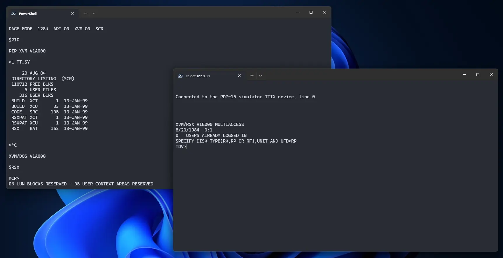
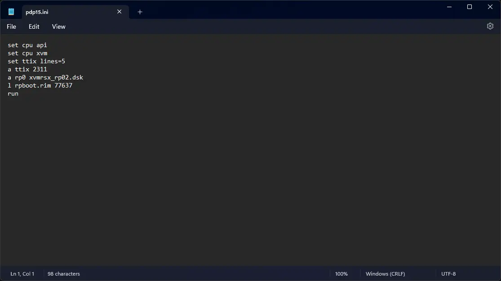
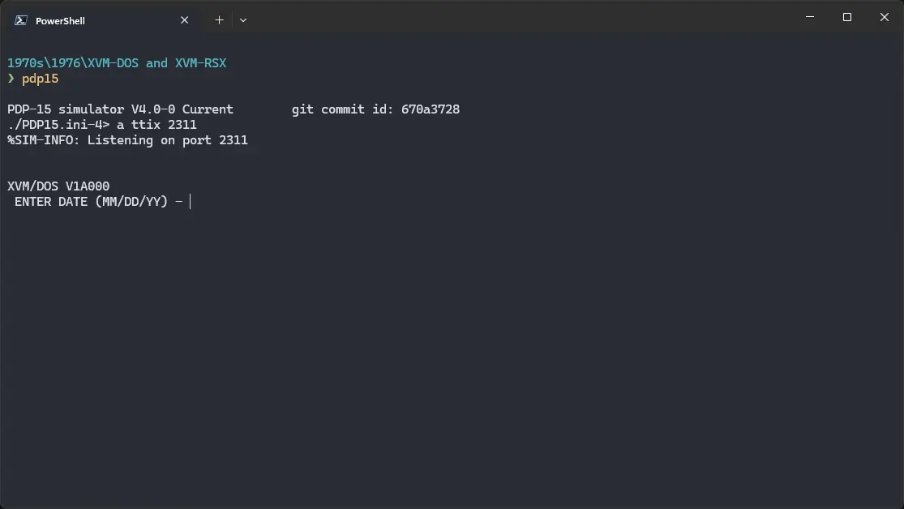
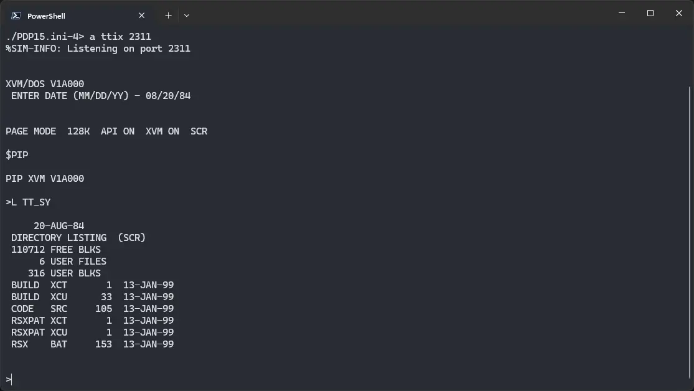

# How to install ! XVM/DOS and ! XVM/RSX on SIMH?



We can run [! XVM/DOS and ! XVM/RSX](/1970s/1976/xvm-dos-rsx) on the SIMH PDP-15 emulator. First, we need to download the ! XVM/RSX and ! XVM/DOS kit.

## Downloads

You can download the kit needed from the ["SIMH Legacy"](http://simh.trailing-edge.com/) website:

- [! XVM/RSX and ! XVM/DOS kit](http://simh.trailing-edge.com/kits/xvmrsx_simh_kit.zip)

## Using ! XVM/DOS & ! XVM/RSX

:::tip

If you have not already installed SIMH PDP-15 emulator, see [the VirtualHub Setup tutorial on how to do so](https://setup.virtualhub.eu.org/simh-pdp15/) on Linux and Windows.

:::

Extract the kit you downloaded. Inside you will find several files. Create a folder somewhere to store the files for this VM and move the files named `xvmrsx_rp02.dsk` and `rpboot.rim` into it.

Now we will create a config file for our VM. Create a text file called `pdp15.ini` with the following content in the VM folder:

```ini
set cpu api
set cpu xvm
set ttix lines=5
a ttix 2311
a rp0 xvmrsx_rp02.dsk
l rpboot.rim 77637
run
```



Now open a terminal and move to the VM folder. Run the following command to start the emulator:

```bash
pdp15
```

If you get a prompt asking if you want to allow network access, click on yes. On Linux, you may want to run the above command with `sudo` or as `root`, for it to work properlly.



When asked for a date, enter it in `MM/DD/YY` format. You _cannot_ use backspace to erase characters, even if it looks like you can. Try entering a date from 1980s or 90s, to avoid any problems.

Now that ! XVM/DOS is ready, let's run some commands on it. Type `PIP` and press enter to start PIP. Then run `L TT_SY` to see the list of files.



That's it! We used ! XVM/DOS. Now, to run ! XVM/RSX, we first need to close PIP. Do so by pressing `Ctrl` + `C`. Then run `RSX` to start ! XVM/RSX.

:::tip

Telnet client may not be installed by default depending on your host operating system. You can install it by following [this VirtualHub Setup tutorial](https://setup.virtualhub.eu.org/telnet/).

:::

To connect to ! XVM/RSX, we need to use telnet. Run `telnet 127.0.0.1 2311` in a new terminal window, and then press `Ctrl` + `T`. When asked for disk type, enter `RP` and press enter. You will be connected to ! XVM/RSX.


That's it, we used ! XVM/RSX. To stop the VM, go back to the main terminal window, and press `Ctrl` + `E`. Then type `exit` and press enter. We can create a shell script to make it easy to launch the VM.

### Linux

Create a file called `xvm-dos-rsx.sh` with the following content:

```bash
#!/bin/bash
pdp15
```

Now make the file executable:

```bash
chmod +x xvm-dos-rsx.sh
```

Now you can start the VM using the shell script. For example, on KDE you can right-click the file and choose `Run in Konsole` or on GNOME, where you can right-click the file and choose `Run as executable`. The VM will start.

See the [manuals section](/1970s/1976/xvm-dos-rsx/#manuals) on the [main ! ! XVM/DOS and ! XVM/RSX page](/1970s/1976/xvm-dos-rsx/) to learn how to use them.

### Windows

Create a file called `xvm-dos-rsx.bat` with the following content:

```bash
pdp15
```

Now you can start the VM by double-clicking the shell script. See the [manuals section](/1970s/1976/xvm-dos-rsx/#manuals) on the [main ! XVM/DOS and ! XVM/RSX page](/1970s/1976/xvm-dos-rsx/) to learn how to use it.

## Credits

- The disk image and other files used above are from a kit available on [SimH “Classic” website](http://simh.trailing-edge.com/).

## Video tutorial

Do you want to follow the tutorial by watching a video? We will post a video on our [YouTube channel](https://www.youtube.com/@virtua1hub) soon.

Archives of this tutorial are available on [Wayback Machine](https://web.archive.org/web/*/https://virtualhub.eu.org/1970s/1976/xvm-dos-rsx/simh/).
