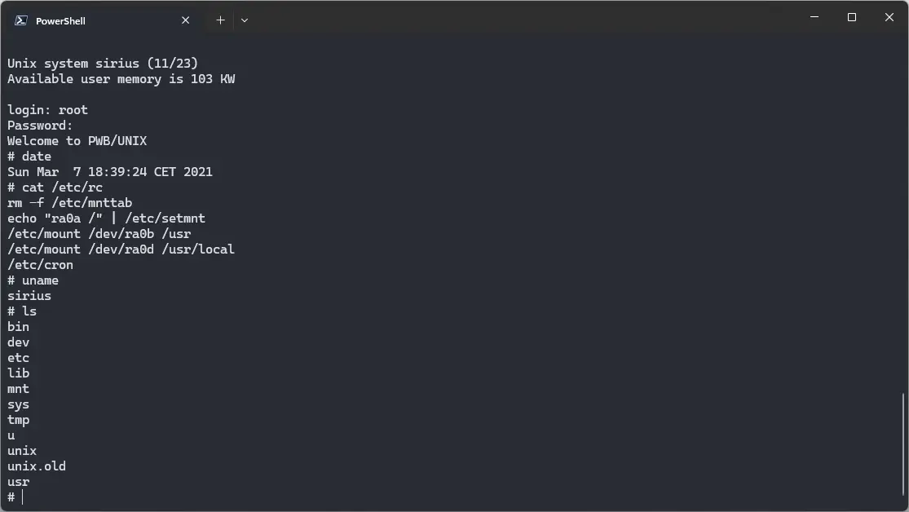

import DocCardList from '@theme/DocCardList';

# ! PWB Unix

[! PWB Unix](https://en.wikipedia.org/wiki/PWB/UNIX) was an operating system for the DEC PDP-11 computer. It was developed at Bell Labs. It can be used on SIMH PDP-11 emulator.

<DocCardList />
 
## Manuals

Here are the manuals for ! PWB Unix:

- [! PWB Unix User's Manual](https://bitsavers.org/pdf/att/unix/PWB_UNIX/PWB_UNIX_Users_Manual_Edition_1.0_197705.pdf)
- [Documents for ! PWB Unix](https://bitsavers.org/pdf/att/unix/PWB_UNIX/Documents_for_the_PWB_UNIX_Time-Sharing_System_Edition_1.0_197710.pdf)

You may also be interested in the PDP-11 manuals. It was the computer on which ! PWB Unix was supposed to run. You can download them from Bitsavers:

- [PDP-11 Manuals](http://bitsavers.org/pdf/dec/pdp11/)

## Related Pages

- [VirtualHub Screenshots](https://screenshots.virtualhub.eu.org/1970s/1977/pwb-unix/)
- [A third part tutorial about installing PWB Unix on SIMH](https://www.hamartun.priv.no/pwb.html)
- [Wikipedia](https://en.wikipedia.org/wiki/PWB/UNIX)
- [Wikipedia PDP-11 page](https://en.wikipedia.org/wiki/PDP-11)
- [Computer History Wiki ! PWB Unix page](https://gunkies.org/wiki/PWB/UNIX)
- [Computer History Wiki PDP-11 page](https://gunkies.org/wiki/PDP-11)

## Credits

- The manuals were taken from [Bitsavers](http://bitsavers.org).
