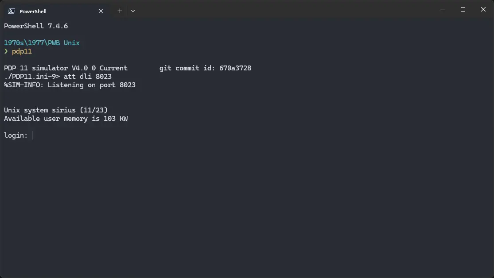

# How to install ! PWB Unix on SIMH?


We can run [! PWB Unix](/1970s/1977/pwb-unix) on the SIMH PDP-11 emulator. First, we need to download the ! PWB Unix image.

## Downloads

You can download the image needed to run ! PWB Unix on the SIMH PDP-11 emulator from here:

- [! PWB Unix image](https://web.archive.org/web/20241218042213/https://www.hamartun.priv.no/tih/UNIX/PWB-1.0-23.rd52.gz)

## Using ! PWB Unix

:::tip

If you have not already installed SIMH PDP-11 emulator, see [the VirtualHub Setup tutorial on how to do so](https://setup.virtualhub.eu.org/simh-pdp11/) on Linux and Windows.

:::

Extract the disk image. If you are on Windows, you may need to install additional software such as [7-Zip](https://www.7-zip.org/) to extract the kit. Create a folder somewhere to store the files for this VM, and move the disk image file into it.

Now we will create a config file for our VM. Create a text file called `pdp11.ini` with the following content in the VM folder:

```ini
set cpu 11/23+
set clk 50hz
set dlo enabled
set dli lines=4
set dlo0 7b
set dlo1 7b
set dlo2 7b
set dlo3 7b
att dli 8023
set rq0 rd52
attach rq0 PWB-1.0-23.rd52
boot rq0
```


Now open a terminal and move to the VM folder. Run the following command to start the emulator:

```bash
pdp11
```



After the emulator starts, login using `root` as the username and `ken` as the password. You can run `date` to see the date and time, `cat` to read text files, `ls` to see list of files and folders in the current directory, and `uname` to see the configured name of the kernel.


To exit the emulator, type `Ctrl` + `E`, and then run `exit`.

That's it! We used ! PWB Unix. We can create a shell script to make it easy to launch the VM.

### Linux

Create a file called `pwb-unix.sh` with the following content:

```bash
#!/bin/bash
pdp11
```

Now make the file executable:

```bash
chmod +x pwb-unix.sh
```

Now you can start the VM using the shell script. For example, on KDE you can right-click the file and choose `Run in Konsole` or on GNOME, where you can right-click the file and choose `Run as executable`. The VM will start.

See the [manuals section](/1970s/1977/pwb-unix/#manuals) on the [main ! PWB Unix page](/1970s/1977/pwb-unix) to learn how to use it.

### Windows

Create a file called `pwb-unix.bat` with the following content:

```bash
pdp11
```

Now you can start the VM by double-clicking the shell script. See the [manuals section](/1970s/1977/pwb-unix/#manuals) on the [main ! PWB Unix page](/1970s/1977/pwb-unix) to learn how to use it.

## Credits

- The disk image and other files used above are taken from this tutorial: [https://www.hamartun.priv.no/pwb.html](https://www.hamartun.priv.no/pwb.html). The disk image is archived on the [Wayback Machine](https://web.archive.org).

## Video tutorial

Do you want to follow the tutorial by watching a video? We will post a video on our [YouTube channel](https://www.youtube.com/@virtua1hub) soon.

Archives of this tutorial are available on [Wayback Machine](https://web.archive.org/web/*/https://virtualhub.eu.org/1970s/1977/pwb-unix/simh/).
