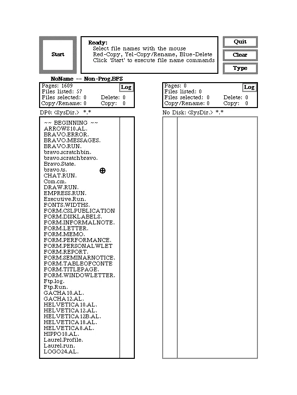

# 1970s

1970s were the age in which microcomputers evolved, but the majority of operating systems we are going to cover are still minicomputer ones. This decade saw the rise of many historic operating systems including Unix, Alto OS (pictured above), Apple DOS and CP/M.

  

    

      <a href="/1970s/1970" className="button button--primary">1970</a>
    

    

      <a href="/1970s/1971" className="button button--primary">1971</a>
    

    

      <a href="/1970s/1973" className="button button--primary">1973</a>
    

    

      <a href="/1970s/1974" className="button button--primary">1974</a>
    

    

      <a href="/1970s/1975" className="button button--primary">1975</a>
    

  

